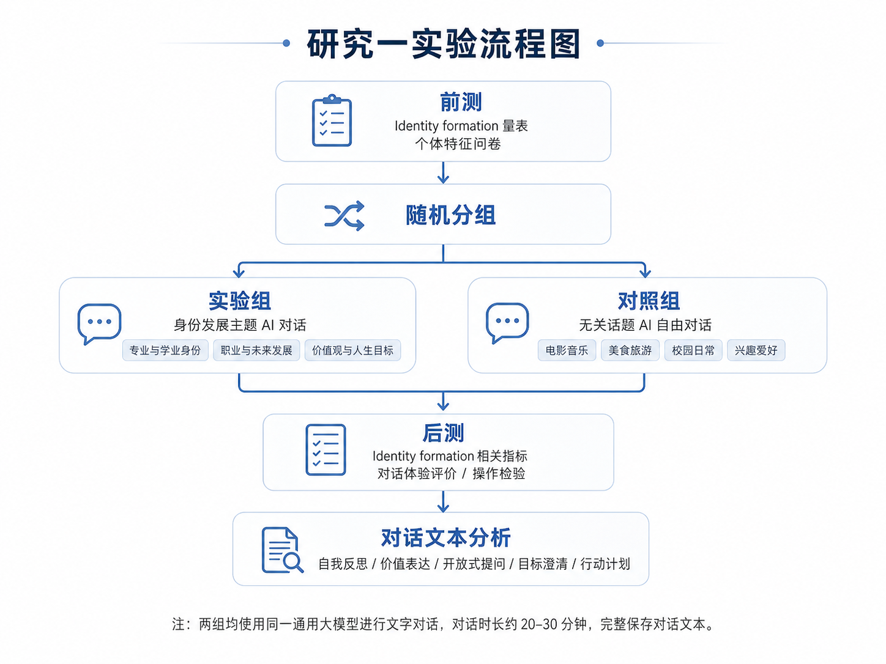

# 研究1-AI对话平台

> Converted from `docs/source/研究1-AI对话平台.docx` on 2026-05-14. The Word source remains in the repository; this Markdown file is for searchable documentation and implementation planning.

> 当前 MVP 实现决策（2026-05-20）：AI 对话为 promptless。本文来自早期研究设计材料，涉及实验组/对照组主题、系统提示语或标准化开场语的内容只作为背景，不得直接作为系统提示词、developer/base instruction 或模型侧话题引导发送给 provider；如未来重新启用提示词条件，需要新的研究协议决策。

**研究一：通用大模型对话对大学生身份形成的初步影响**

# 一、研究假设

基于身份发展理论与人机对话支持自我反思的相关观点，本研究提出以下初步假设：

> · 假设 1：身份发展主题 AI 对话后，实验组被试在自我探索、承诺形成或承诺认同等指标上将出现一定程度的提升。
>
> · 假设 2：与对照组相比，实验组在身份形成相关指标上的前后测变化更明显。
>
> · 假设 3：用户自我反思程度、价值观表达、目标澄清、AI 开放式提问和行动计划生成等对话特征，与身份形成相关指标的提升存在正相关。
>
> · 假设 4：AI 信任、自我概念清晰性、认知反思能力和既往 AI 使用经验等个体差异变量，可能调节身份发展主题对话的效果。

# 二、研究设计

本研究采用前测—干预—后测的两组实验设计。所有被试在前测阶段完成身份形成相关量表和个体特征问卷，随后被随机分配至实验组或对照组。两组均与同一通用大模型进行文字对话，实验组围绕身份发展相关主题展开，对照组围绕无关自由话题展开。对话结束后，被试立即完成后测问卷，研究者同时保存完整对话文本用于后续分析。

**图1 研究一实验流程图**

## 2.1 实验组：身份发展主题 AI 对话

实验组被试与通用大模型围绕身份发展相关主题进行对话。对话的核心目标不是直接给出人生建议，而是通过开放式提问、观点澄清、反思性反馈和行动计划整理，帮助被试更系统地思考“我是谁”“我想成为什么样的人”“我如何做出选择并认同这些选择”等问题。

为保证研究一的可操作性和标准化程度，实验组可优先采用 2—3 个固定主题作为对话入口。建议主题包括：专业与学业身份、职业与未来发展身份、价值观与人生目标。根据研究需要，也可扩展至自我认识、兴趣与优势、重要关系中的自我定位等主题。

## 2.2 对照组：无关话题 AI 自由对话

对照组被试同样与通用大模型进行文字对话，但对话内容限定为与身份发展无关的自由话题。可选话题包括电影、音乐、运动、美食、旅游、校园日常、兴趣爱好和一般知识性聊天等。

对照组的设置目的在于控制“与AI对话本身”带来的非特异性影响。研究过程中应明确要求对照组避免讨论专业选择、职业规划、人生目标、价值观、自我认识等身份发展相关内容。若对照组对话中自然出现上述内容，应在后续操作检验和数据清理中予以记录。

## 2.3 研究设计概要

| **项目** | **实验组** | **对照组** |
|:--:|----|----|
| 对话对象 | 同一通用大模型 | 同一通用大模型 |
| 对话形式 | 文字对话 | 文字对话 |
| 对话主题 | 身份发展相关主题 | 与身份发展无关的自由话题 |
| 对话时长 | 约 20—30 分钟 | 约 20—30 分钟 |
| 最低轮次 | 不少于 10 轮 | 不少于 10 轮 |
| 主要控制点 | 引导自我探索、选择澄清和目标反思 | 避免自我探索、职业规划、价值观等身份主题 |

**表1 两组实验条件设置概要**

# 三、研究对象与样本

研究对象为在校大学生，建议以本科生为主。基本纳入标准包括：当前为在校大学生；能够完成文字形式的人机对话；同意研究者记录并分析对话文本；自愿参与研究并签署知情同意。

排除标准可包括：无法完成前后测问卷；未按要求完成对话任务；对话轮次明显不足；对照组大量讨论身份发展相关主题；实验过程中出现明显无效作答或重复粘贴等情况。正式实施前，需根据预期效应量、统计功效和实际招募条件确定样本量。若研究一定位为探索性初步研究，可先进行小样本预实验，以检验流程、提示语、量表耗时和文本保存方式的可行性。

# 四、研究流程

## 4.1 前测

被试首先完成前测问卷。前测内容主要包括身份形成相关指标和个体特征变量。身份形成可使用 DIDS 或 U-MICS 等成熟量表，重点测量探索、承诺形成和承诺认同等维度。个体特征方面可测量人格特质、自我概念清晰性、认知反思能力、AI使用经验与AI信任等变量。

## 4.2 随机分组

前测结束后，被试被随机分配至实验组或对照组。研究者应尽量保证两组在性别、年级、专业背景、AI使用经验等关键变量上的平衡。若样本量允许，可采用区组随机或分层随机方式，以降低组间基线差异对结果解释的影响。

## 4.3 对话任务

两组均与同一通用大模型进行文字对话。建议统一对话平台、模型版本、系统提示语、对话时长和最低轮次。对话时长可设置为20至30分钟，对话轮次不少于10轮，并完整保存用户输入与AI回复。

实验组的对话重点是引导被试围绕身份发展主题进行自我探索和选择澄清。对照组的对话重点是轻松聊天，不主动引导自我探索或未来规划。为了提高可控性，建议为两组分别设计标准化开场语和规则说明，并在对话结束后记录被试是否严格遵守任务要求。

## 4.4 后测

对话结束后，被试立即完成后测问卷。后测内容包括身份形成相关指标、对话满意度、被理解感、自我清晰感、对话启发性以及操作检验题项。操作检验题项可询问本次对话是否涉及自我探索、未来目标、价值观、专业选择或职业规划等内容。

# 五、测量指标

| **测量类别** | **变量示例** | **测量时间** | **用途** |
|----|----|----|----|
| 身份形成指标 | 探索、承诺形成、承诺认同 | 前测、后测 | 检验主要干预效果 |
| 个体特征 | 人格特质、自我概念清晰性、认知反思能力 | 前测 | 检验调节作用或控制基线差异 |
| AI 相关变量 | AI 使用经验、AI 信任 | 前测 | 检验人机对话获益差异 |
| 对话体验 | 满意度、被理解感、自我清晰感、启发性 | 后测 | 解释主观体验与效果差异 |
| 操作检验 | 是否涉及自我探索、未来目标、价值观 | 后测与文本编码 | 确认实验操纵是否有效 |

**表2 研究一主要测量指标**

# 六、对话文本记录与分析

本研究将保存被试与大模型的完整对话文本，用于探索身份发展主题 AI 对话可能发挥作用的机制。文本分析既可采用人工编码，也可结合自然语言处理方法进行辅助分析。建议先建立明确的编码框架，再由两名及以上编码者进行独立编码，并计算一致性指标。

可重点分析以下文本特征：用户是否进行了自我反思；用户是否表达了价值观、目标或选择困惑；AI 是否进行了开放式提问；AI 是否帮助用户澄清选择；AI 是否引导用户形成具体行动计划；对话是否从模糊困惑走向更清晰的自我理解。

在统计分析中，可将这些文本特征与前后测变化量进行关联，进一步探索哪些用户表达方式或 AI 回复方式可能更有利于身份形成。该部分结果可为后续更严格的干预研究、提示语优化和机制模型建构提供依据。

# 七、数据分析方案

首先进行操作检验，确认实验组对话确实比对照组更多涉及身份发展相关内容。操作检验可以结合后测自评题项和对话文本编码完成。若对照组中出现大量身份发展内容，需在分析中进行敏感性检验，或将其作为排除标准之一。

随后检验组别与时间的交互效应。核心自变量包括组别和时间，其中组别为实验组与对照组，时间为前测与后测；因变量为身份形成各维度。若实验组在探索、承诺形成或承诺认同等指标上的提升显著大于对照组，则可初步说明身份发展主题 AI 对话可能对大学生身份形成具有促进作用。

进一步分析可包括：以前测水平为协变量的 ANCOVA；以变化量为因变量的回归分析；将 AI 信任、自我概念清晰性、认知反思能力等变量纳入调节模型；将文本编码特征纳入中介或机制探索模型。由于研究一定位为初步探索，统计结论应强调效应大小、置信区间和可重复性，而不宜过度解释因果机制。

# 八、预期结果与研究意义

本研究预期发现，与无关话题自由对话相比，身份发展主题 AI 对话可能更有助于提升大学生的自我探索、选择承诺和对承诺的认同。与此同时，不同个体从 AI 对话中获得的帮助可能存在差异，这种差异可能与 AI 信任、自我概念清晰性、认知反思能力和既往 AI 使用经验有关。

研究一的主要意义在于：第一，初步检验通用大模型对话促进大学生身份形成的可能性；第二，为后续更严格的随机对照研究提供对话主题、测量指标和机制假设；第三，从真实对话文本中提取可能有效的 AI 对话方式，为心理发展支持型 AI 对话设计提供经验基础。

# 九、进一步明确的信息

> · 明确样本量依据，包括预期效应量、统计功效、每组目标人数和可能的脱落率。
>
> · 确定最终使用的身份形成量表版本、语言版本、维度结构和计分方式。
>
> · 明确通用大模型的具体平台、模型版本、系统提示语和实验组/对照组的标准化开场语。
>
> · 补充对照组话题限制与违规处理规则，避免对照组自然进入身份发展主题。
>
> · 制定对话文本脱敏、保存、访问权限和删除机制。
>
> · 补充人工文本编码手册，包括编码维度、编码示例、编码者培训和一致性检验方法。
>
> **讲稿**

研究一主要想回答一个问题：大学生和通用大模型围绕身份发展主题进行对话，是否会促进他们的 Identity formation。

本研究采用前测—干预—后测的两组实验设计。实验组和大模型讨论身份发展相关主题，例如专业选择、未来职业、自我认识、价值观和人生目标。对照组也和大模型对话，但只讨论无关话题，例如电影、音乐、美食、旅游或校园日常。这样可以控制单纯与 AI 互动带来的新奇感和陪伴感。

\[图\]

在测量上，我们会在对话前后测量 Identity formation 的核心指标。同时，也会测量一些个体特征，比如人格、自我概念清晰性、认知反思能力以及 AI 信任。

研究一还会记录完整的人机对话文本。我们不仅关心实验组是否比对照组变化更大，也关心什么样的对话可能更有效。例如，AI 是否提出开放式问题，是否帮助学生澄清价值观，是否引导学生形成更清晰的目标和行动计划。

数据分析上，重点看组别和时间的交互效应。如果实验组在前后测中的提升明显大于对照组，就说明身份发展主题的 AI 对话可能对大学生 Identity formation 有促进作用。

总体来说，研究一是一个探索性研究，目的是为后续更严格的 RCT 实验提供基础。
